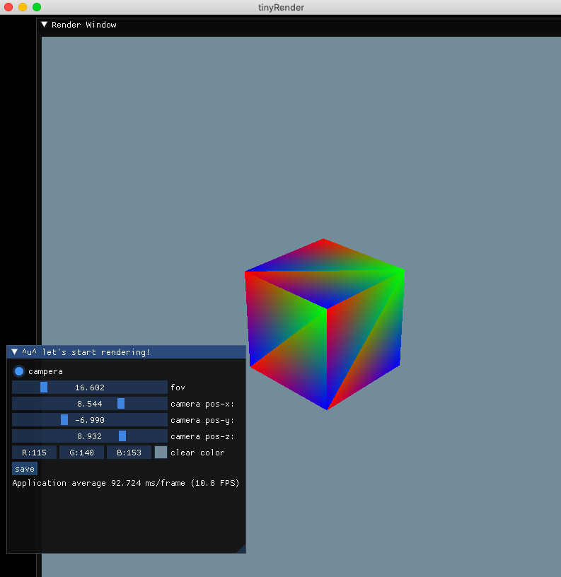

# SoftRenderer
---
- - -

### 第三方库依赖
* glad+glfw
* imgui工具
* stb图片处理库

## 运行截图

## 渲染展示

### **Texture Filtering** 
#### Nearest Neighbor

#### Bilinear

#### MipMap
#### * with mipmap off

#### * with mipmap on

#### * visiable mipmap 

### **Screen-Space Ambient Occlusion**
#### without blur (noise)

#### with blur

- - -
### **Blinn-Phong**
#### with soft shadow PCF（Percentage Closer filtering)

### **Skybox**
#### with environment mapping

### **Post Process**

### **PBR**
