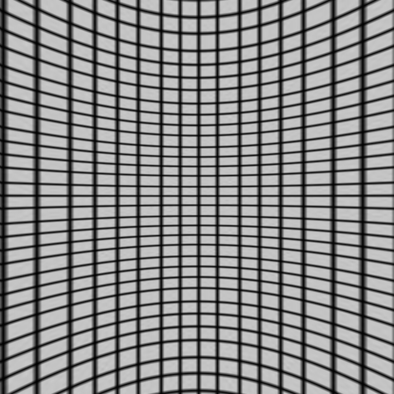
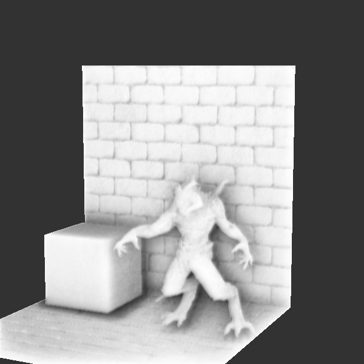
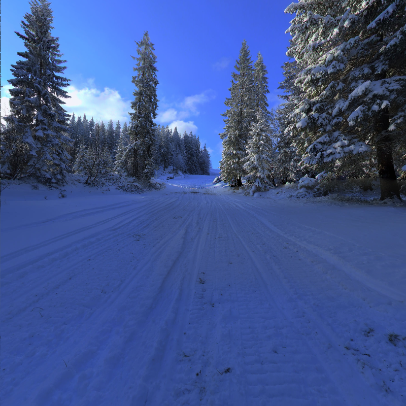
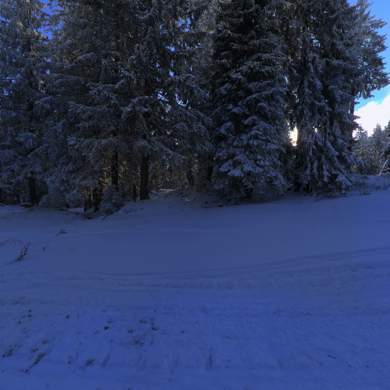

# SoftRenderer

## 第三方库依赖
* glad+glfw
* imgui工具
* stb图片处理库

## 运行截图

<table>
    <tr>
        <td><figure >
            <figcaption></figcaption>
            </figure>
            <figure>
        </td>
    </tr>
</table>

## 渲染展示

## **Texture**
### **Texture Filtering** 

<table>
    <tr>
        <td><figure >
            <figcaption> Nearest Neighbor</figcaption>
            </figure>
            <figure>
        </td>
        <td><figure >
            <figcaption >Bilinear</figcaption>
            <figure>
        </td>
    </tr>
</table>

### **MipMap**

<table>
    <tr>
        <td><figure >
            <figcaption> with mipmap off</figcaption>
            </figure>
            <figure>
        </td>
        <td><figure >
            <figcaption >with mipmap on</figcaption>
            <figure>
        </td>
    </tr>
    <tr>
        <td><figure >
            <figcaption >* visualize mipmap </figcaption>
            <figure>
        </td>
    </tr>
</table>

### **Perspective correct**

<table>
    <tr>
        <td><figure >
            <figcaption> without Perspective correction</figcaption>
            </figure>
            <figure>
        </td>
        <td><figure >
            <figcaption >with Perspective correction</figcaption>
            <figure>
        </td>
    </tr>
</table>

### **Skybox**

<table>
    <tr>
        <td><figure >
            <figcaption>with simple environment mapping</figcaption>
            </figure>
            <figure>
        </td>
    </tr>
</table>

#### generate 6 skybox textures from Equi-rectangular Projection
#### origin:

- - -

## **Screen-Space Ambient Occlusion**

<table>
    <tr>
        <td><figure >
            <figcaption> without blur (noise)</figcaption>
            </figure>
            <figure>
        </td>
        <td><figure >
            <figcaption >with blur</figcaption>
            <figure>
        </td>
    </tr>
</table>

- - -

## **Blinn-Phong**
#### with soft shadow PCF（Percentage Closer filtering)

## **Post Process**

## **Physically Based Rendering**

